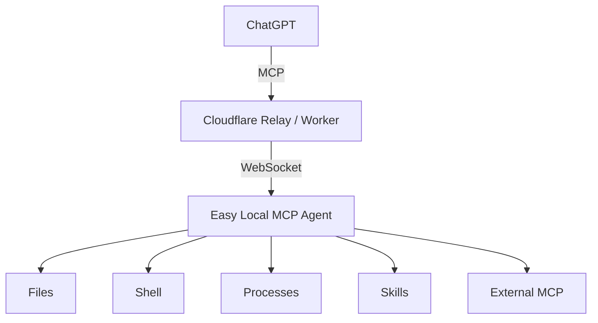

<p align="center">
  
</p>

<h1 align="center">Easy Local MCP</h1>

<p align="center">
  A secure local MCP bridge that lets ChatGPT work with your files, shell, processes, skills, workspaces, and external MCP servers.
</p>

<p align="center">
  <a href="README.zh-CN.md">Chinese README</a>
</p>

## What is Easy Local MCP?

Easy Local MCP connects ChatGPT to capabilities on your own computer through the Model Context Protocol (MCP).



The Agent makes the outbound connection, so you do not need a public IP address or an inbound port.

Easy Local MCP is based on [daodao97/localmcp](https://github.com/daodao97/localmcp) and is maintained as an independent project.

## Highlights

- Windows desktop app with Control Center and system tray
- Files: browse, search, read, create, edit, move, and delete
- Shell commands and persistent processes
- Multiple workspaces
- Skills
- External MCP servers through a stable gateway
- Safe-by-default permission model
- Local LOCK / UNLOCK gate for privileged operations
- Authenticated local IPC
- Audit logging and credential rotation
- Public Relay for quick setup, with self-hosted options for long-term or sensitive use
- Bundled Node runtime in the Windows installer

## Install

### Windows

Download the latest Windows x64 installer from [GitHub Releases](https://github.com/Ryanma-YX/easy-local-mcp/releases/latest).

The desktop installer includes the required runtime. The target PC does not need Node.js or Rust.

### Build from source

Requirements:

- Node.js 22+
- Rust stable for the desktop app
- Visual Studio 2022 / MSVC and Windows SDK for the Windows installer

```powershell
git clone https://github.com/Ryanma-YX/easy-local-mcp.git
cd easy-local-mcp
npm ci
npm run desktop:bundle
```

## Quick start

1. Start **Easy Local MCP**.
2. Choose the public Relay for a quick start, or enter the URL of a Relay you control.
3. Click **Save & Start Agent**.
4. In Control Center, use **Reveal / Copy MCP URL**.
5. Enable ChatGPT Developer Mode: [Open Developer Mode settings](https://chatgpt.com/#settings/Security?section=developer-mode).
6. Create a connector: [Open Create Connector](https://chatgpt.com/plugins#settings/Connectors?create-connector=true&redirectAfter=%2Fplugins).
7. Paste the complete MCP URL and set **Authentication** to **None**.
8. Start a new chat and use the connector.

> ChatGPT may hide the Create Connector entry in the normal UI. The direct link above opens the connector creation page.

The complete MCP URL contains an access credential. Do not post it in issues, screenshots, logs, chats, or Git repositories.

## Security model

The Agent starts **LOCKED**.

Configured privileged tools remain visible in the MCP tool list while locked so ChatGPT can discover and refresh connector capabilities correctly. Visibility does **not** grant execution permission.

While LOCKED:

- read-only capabilities remain available when enabled
- configured privileged capabilities remain discoverable
- file writes, deletes, shell commands, processes, and external MCP execution are denied

Privileged operations become callable only after a local Unlock and are blocked again when the Unlock expires or the Agent is locked.

For the full security model, see [SECURITY.md](SECURITY.md) and the [Security Model wiki page](https://github.com/Ryanma-YX/easy-local-mcp/wiki/Security-Model).

## Common commands

```powershell
easy-local-mcp ui
easy-local-mcp status
easy-local-mcp url
easy-local-mcp unlock
easy-local-mcp lock
easy-local-mcp reload
easy-local-mcp rotate
easy-local-mcp join <zone-code>
easy-local-mcp stop
```

The legacy `localmcp` command remains available for compatibility.

## Self-host the Relay

The prefilled public Relay is currently provided as an upstream/community shared service and is convenient for quick evaluation. Because it is operated outside this fork, this project cannot guarantee its availability, capacity, or long-term continuity.

For regular use, company source code, ERP/MES data, internal files, credentials, or production environments, a Relay under your own control is recommended. You can host it on a machine you manage (with a reachable HTTPS endpoint), on your own VPS, or on your own Cloudflare Worker.

[](https://deploy.workers.cloudflare.com/?url=https://github.com/Ryanma-YX/easy-local-mcp)

After deployment, copy the Relay or Worker URL and configure it in Easy Local MCP.

See [Self-hosted Relay](https://github.com/Ryanma-YX/easy-local-mcp/wiki/Self-hosted-Relay) for deployment and registration-protection details.

## Multi-Device Zones

A Relay can group several devices into a Zone. Open `/admin` on a Zone-capable Relay to create a Zone, generate a one-time join code, view device status, rename devices, or revoke them. On a stopped device, stage the join with `localmcp join <zone-code>`, then start Easy Local MCP normally.

The first Zone release is a management layer only: each device still keeps its own MCP URL. A unified Zone connector/router is a separate follow-up. See [Multi-Device Zones](https://github.com/Ryanma-YX/easy-local-mcp/wiki/Multi-Device-Zones).

## Development

```powershell
npm ci
npm run check
npm test
npm run build
```

Desktop-related commands:

```powershell
npm run tray:check
npm run tray:build
npm run desktop:bundle
```

More documentation is available in the [project Wiki](https://github.com/Ryanma-YX/easy-local-mcp/wiki).

## Project origin

Easy Local MCP is derived from [daodao97/localmcp](https://github.com/daodao97/localmcp). Thanks to the original project for the Local MCP and Relay foundation.

This fork is maintained independently and is not intended to merge back upstream.

## License

MIT. See [LICENSE](LICENSE).
