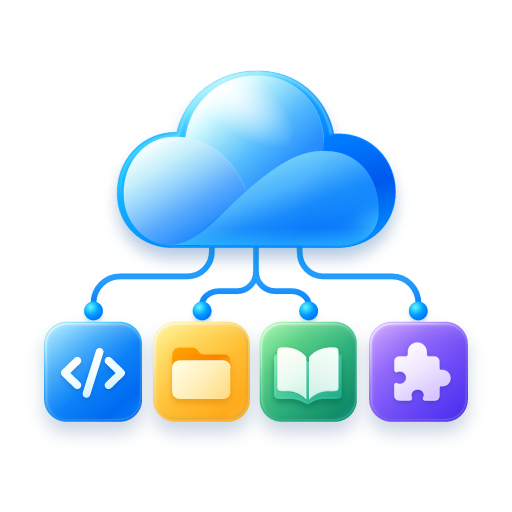

<p align="center">
  
</p>

<h1 align="center">Easy Local MCP</h1>

<p align="center">
  让 ChatGPT 通过 <strong>MCP (Model Context Protocol)</strong> 安全地使用你的本机文件、Shell、进程、Skills 与外部 MCP Server。
</p>

## 项目说明

**Easy Local MCP** 是基于 [daodao97/localmcp](https://github.com/daodao97/localmcp) 演进的独立分支。

原项目提供了 Local MCP / Cloudflare Relay 的基础实现，本项目在此基础上重点增强：

- Windows 桌面客户端与系统托盘
- 本地 Control Center
- 更严格的默认权限与 LOCK / UNLOCK
- 文件读写删除权限拆分
- Shell / Process / External MCP feature gates
- 本地 authenticated IPC
- 首次启动 Relay 配置向导
- Windows 后台进程隐藏控制台窗口
- Tauri + NSIS 独立安装包
- 内置 Node runtime，目标 PC 不需要安装 Node 或 Rust
- 审计日志、凭证轮换与 Worker 注册保护

本项目不再以向上游合并为目标，后续会以 **Easy Local MCP** 独立维护。

> Easy Local MCP 仍遵循原项目的 MIT License，并保留原项目来源与版权信息。

## 为什么叫 Easy Local MCP

目标很简单：

> **让安装、配置、连接 ChatGPT 和管理本机 MCP 权限变得尽量简单。**

MCP 是 **Model Context Protocol** 的缩写，因此项目名称中统一写作全大写 **MCP**。

## 功能

Easy Local MCP 可以把以下本机能力安全地暴露给 MCP 客户端：

- 文件浏览、搜索与读取
- 文件创建、修改、移动与删除
- Shell 命令
- 持久进程
- Skills
- 多 Workspace
- 外部 MCP Server
- 本地 Control Center
- Agent Start / Stop / Restart
- LOCK / UNLOCK
- MCP URL reveal / credential rotation
- Relay / Worker 切换
- Audit history

危险能力默认不会全部开放。

Agent 启动后默认处于：

```text
LOCKED
```

即使配置允许 Shell / 写文件 / Process，仍需要在本机明确 Unlock 后才能调用。

---

## Windows 安装

### 推荐：安装桌面版

构建后的安装包位于：

```text
src-tauri/target/release/bundle/nsis/
```

文件名类似：

```text
Easy Local MCP_0.3.9_x64-setup.exe
```

安装后直接启动：

```text
Easy Local MCP
```

桌面版已经内置：

- Tauri native shell
- Node runtime
- Easy Local MCP compiled app
- production dependencies

因此目标 PC **不需要另外安装 Node、npm 或 Rust**。

### 从源码构建 Windows 安装包

需要：

- Node.js 22+
- Rust stable
- Visual Studio 2022 / MSVC
- Windows SDK

然后：

```powershell
git clone https://github.com/Ryanma-YX/easy-local-mcp.git
cd easy-local-mcp

npm ci
npm run desktop:bundle
```

安装包会生成到：

```text
src-tauri\target\release\bundle\nsis\
```

---

## 首次启动

第一次启动桌面版时，**Agent 不会自动连接任何 Relay**。

流程：

1. Easy Local MCP 先只启动本机 Control Center
2. 选择 Relay
3. 默认公共 Relay 已预填，但此时不会联网注册
4. 如使用自建 Relay，可填写自己的 Worker URL
5. 如果 Worker 开启注册保护，可填写 Registration Token
6. 点击：

```text
Save & Start Agent
```

之后才会：

```text
保存 Relay
→ 注册设备
→ 启动 Agent
→ 建立 Relay 连接
→ 生成 MCP URL
```

### 公共 Relay

公共 Relay 适合快速开始。

但它属于**可信中继基础设施**，当前架构不是 ChatGPT 到本机 Agent 的端到端加密。

对于：

- 公司源码
- ERP / MES
- 内部文件
- 凭证
- 生产环境

建议使用自己的 Relay / Cloudflare Worker。

---

## 连接 ChatGPT

Agent 启动后，可以在 Control Center 中：

```text
Reveal / Copy MCP URL
```

也可以使用兼容 CLI：

```powershell
localmcp url
```

或新的品牌命令：

```powershell
easy-local-mcp url
```

然后在 ChatGPT 中：

1. 打开 Developer Mode
2. 添加 MCP / Connector
3. 填入完整 MCP URL
4. Authentication 选择：

```text
None
```

完整 MCP URL 本身就是访问凭证，请不要：

- 提交到 Git
- 发到公开群组
- 放进 issue
- 放在公开截图
- 写入普通日志

---

## 常用操作

新命令：

```powershell
easy-local-mcp ui
easy-local-mcp status
easy-local-mcp url
easy-local-mcp unlock
easy-local-mcp lock
easy-local-mcp reload
easy-local-mcp rotate
easy-local-mcp stop
```

为了兼容已有用户，旧命令仍然可用：

```powershell
localmcp
localmcp ui
localmcp status
```

兼容状态目录和环境变量也继续保留：

```text
~/.localmcp/
LOCALMCP_*
```

因此升级 Easy Local MCP 不要求现有用户迁移配置。

---

## 自建 Relay

对于敏感环境，建议使用自己的 Cloudflare Worker。

部署原理：

```text
ChatGPT
   ↓ MCP
Cloudflare Worker / Relay
   ↓ WebSocket
Easy Local MCP Agent
   ↓
Local files / shell / tools
```

Worker 部署命令：

```powershell
npm ci
npm run worker:deploy
```

然后在首次启动界面填写你的 Worker URL。

如果 Worker 配置了：

```text
REGISTRATION_TOKEN_HASH
```

则在 Easy Local MCP 首次设置中填写对应 raw registration token。

Registration Token：

- 不进入 MCP URL
- 不写入 localmcp.json
- 不进入 audit log
- 注册成功并持久化本地凭据后会删除临时 token

---

## 安全模型

Easy Local MCP 是一个**高权限本地 Agent**。

它以当前操作系统用户权限运行。

### 文件工具

文件工具受 Workspace 边界限制。

### Shell

Shell **不是 Workspace sandbox**。

Shell 可以访问当前 OS 用户能够访问的：

- 其他目录
- 其他盘符
- 网络
- 系统命令
- 当前用户权限范围内的资源

因此危险能力同时要求：

```text
功能已启用
+
Agent 已 Unlock
```

### Windows

后台命令、Agent、Process 和 bundled Node host 默认使用隐藏窗口方式启动，避免 MCP 调用过程中反复闪出 CMD / PowerShell 黑框。

---

## Desktop / Tray

桌面版支持：

- 原生 Control Center 窗口
- 系统托盘
- 左键托盘恢复窗口
- Show
- Hide
- Quit
- 关闭窗口隐藏到托盘

Tray Quit：

```text
退出 Desktop UI
关闭对应 Control Center host
不停止独立运行的 Agent
```

Agent 与桌面 UI 生命周期相互独立。

---

## 开发

安装依赖：

```powershell
npm ci
```

检查：

```powershell
npm run check
```

测试：

```powershell
npm test
```

构建 Node：

```powershell
npm run build
```

检查 Tauri：

```powershell
npm run tray:check
```

构建 Tray：

```powershell
npm run tray:build
```

构建 Windows 安装包：

```powershell
npm run desktop:bundle
```

---

## 项目来源与致谢

Easy Local MCP 基于：

**daodao97/localmcp**

https://github.com/daodao97/localmcp

感谢原作者提供 Local MCP、Relay 与 Worker 的基础实现。

本项目在其基础上继续开发，并作为独立分支维护。

当前维护仓库：

https://github.com/Ryanma-YX/easy-local-mcp

## License

MIT License。

详见 [LICENSE](LICENSE) 和 [SECURITY.md](SECURITY.md)。
