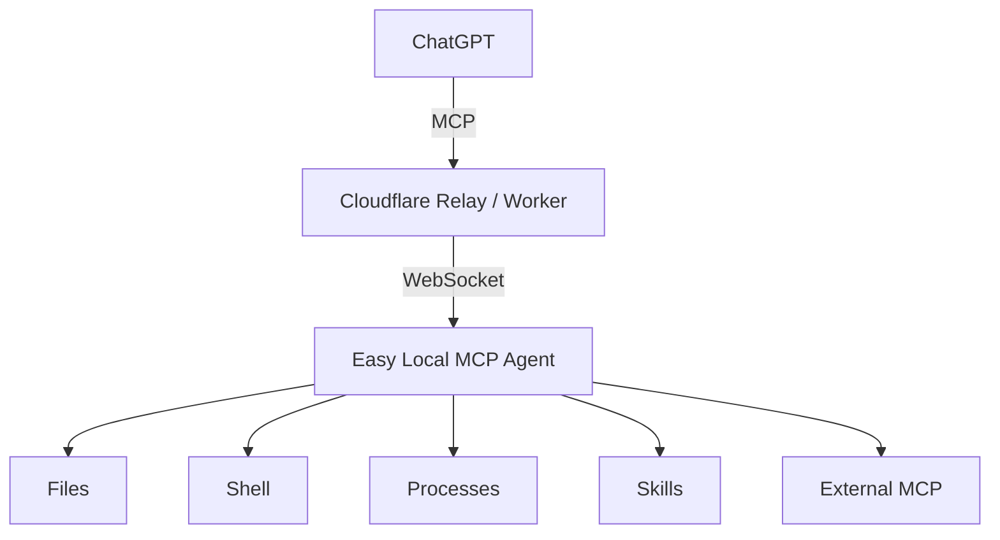

<p align="center">
  
</p>

<h1 align="center">Easy Local MCP</h1>

<p align="center">
  让 ChatGPT 通过 MCP 安全地使用你的本机文件、Shell、进程、Skills、Workspace 与外部 MCP Server。
</p>

<p align="center">
  <a href="README.md">English</a>
</p>

## Easy Local MCP 是什么？

Easy Local MCP 通过 Model Context Protocol（MCP）把 ChatGPT 与你自己的电脑连接起来。



Agent 主动向 Relay 建立连接，因此不需要公网 IP，也不需要开放入站端口。

Easy Local MCP 基于 [daodao97/localmcp](https://github.com/daodao97/localmcp) 演进，目前作为独立项目维护。

## 主要功能

- Windows 桌面客户端、Control Center 与系统托盘
- 文件浏览、搜索、读取、创建、编辑、移动与删除
- Shell 命令与持久进程
- 多 Workspace
- Skills
- 通过稳定网关接入外部 MCP Server
- 默认安全的权限模型
- 本地 LOCK / UNLOCK 特权操作保护
- 带认证的本地 IPC
- 审计日志与凭证轮换
- 可用公共 Relay 快速体验，也支持自建 Relay 作为长期或敏感场景方案
- Windows 安装包内置 Node runtime

## 安装

### Windows

从 [GitHub Releases](https://github.com/Ryanma-YX/easy-local-mcp/releases/latest) 下载最新的 Windows x64 安装包。

桌面安装包已经包含运行所需环境，目标电脑不需要另外安装 Node.js 或 Rust。

### 从源码构建

需要：

- Node.js 22+
- 构建桌面版需要 Rust stable
- 构建 Windows 安装包需要 Visual Studio 2022 / MSVC 与 Windows SDK

```powershell
git clone https://github.com/Ryanma-YX/easy-local-mcp.git
cd easy-local-mcp
npm ci
npm run desktop:bundle
```

## 快速开始

1. 启动 **Easy Local MCP**。
2. 可以先用公共 Relay 快速体验，也可以直接填写自己控制的 Relay URL。
3. 点击 **Save & Start Agent**。
4. 在 Control Center 中使用 **Reveal / Copy MCP URL**。
5. 打开 ChatGPT Developer Mode：[点我打开](https://chatgpt.com/#settings/Security?section=developer-mode)。
6. 创建 Connector：[点我打开创建页面](https://chatgpt.com/plugins#settings/Connectors?create-connector=true&redirectAfter=%2Fplugins)。
7. 填入完整 MCP URL，并把 **Authentication** 设置为 **None**。
8. 新建会话并使用该连接器。

> 如果 ChatGPT 当前界面隐藏了 Create Connector / 创建连接器入口，可以直接使用上面的直达链接。

完整 MCP URL 本身包含访问凭证，请不要把它提交到 Git、Issue、公开截图、聊天记录或普通日志中。

## 安全模型

Agent 启动后默认处于 **LOCKED** 状态。

在 LOCKED 状态下，配置中已经启用的特权工具仍会出现在 MCP 工具列表里，这样 ChatGPT 可以正常发现和刷新连接器能力；**可见不等于可执行**。

LOCKED 时：

- 已启用的只读能力可以正常使用
- 已启用的特权能力仍然可以被 ChatGPT 发现
- 写文件、删除、Shell、Process、外部 MCP 执行仍会被拒绝

只有在本机明确 Unlock 后，特权操作才真正可执行；Unlock 到期或重新 Lock 后会立即恢复拦截。

完整安全说明请阅读 [SECURITY.md](SECURITY.md) 和 [Wiki：安全模型](https://github.com/Ryanma-YX/easy-local-mcp/wiki/Security-Model)。

## 常用命令

```powershell
easy-local-mcp ui
easy-local-mcp status
easy-local-mcp url
easy-local-mcp unlock
easy-local-mcp lock
easy-local-mcp reload
easy-local-mcp rotate
easy-local-mcp join <zone-code>
easy-local-mcp stop
```

为了兼容已有用户，旧的 `localmcp` 命令仍然可用。

## 自建 Relay

当前预填的公共 Relay 由上游/社区共享服务提供，很适合快速体验。由于该服务并非由本项目维护，因此其可用性、容量以及长期持续性无法由本项目保证。

如果准备长期使用，或者会接触公司源码、ERP / MES 数据、内部文件、凭证与生产环境，更建议把 Relay 部署在自己可控的环境中，例如具备可访问 HTTPS 入口的本机/内网主机、自己的 VPS，或自己的 Cloudflare Worker。

[](https://deploy.workers.cloudflare.com/?url=https://github.com/Ryanma-YX/easy-local-mcp)

部署完成后，把自己的 Relay / Worker URL 填入 Easy Local MCP 即可。

Registration Token、注册保护和部署细节请阅读 [Wiki：自建 Relay](https://github.com/Ryanma-YX/easy-local-mcp/wiki/Self-hosted-Relay)。

## 多设备 Zone

支持 Zone 的 Relay 可以把多台设备归入同一个管理区。打开 Relay 的 `/admin` 可以创建 Zone、生成一次性 Join Code、查看设备在线状态、重命名设备或撤销设备。设备必须先停止 Easy Local MCP，然后执行 `localmcp join <zone-code>`，再正常启动即可完成加入。

Zone 现在也提供一个统一的 MCP Connector URL。ChatGPT 只需要连接这个 Zone URL，即可先调用 `list_devices`，然后在正常 LocalMCP 工具中通过必填的 `device` 参数选择目标设备。原有每台设备独立的 MCP URL 仍然保留兼容性，而且目标 Agent 仍会执行本机 LOCK 和功能权限检查。早期版本已经创建的 Zone 无需重建，只要在 `/admin` 中点击 **Rotate Connector** 即可生成统一 Connector URL。详见 [Wiki：Multi-Device Zones](https://github.com/Ryanma-YX/easy-local-mcp/wiki/Multi-Device-Zones)。

## 开发

```powershell
npm ci
npm run check
npm test
npm run build
```

桌面相关命令：

```powershell
npm run tray:check
npm run tray:build
npm run desktop:bundle
```

更多使用、配置和排错内容放在 [项目 Wiki](https://github.com/Ryanma-YX/easy-local-mcp/wiki)。

## 项目来源

Easy Local MCP 基于 [daodao97/localmcp](https://github.com/daodao97/localmcp) 演进，感谢原作者提供 Local MCP 与 Relay 的基础实现。

本项目目前独立维护，不再以合并回上游为目标。

## License

MIT，详见 [LICENSE](LICENSE)。
