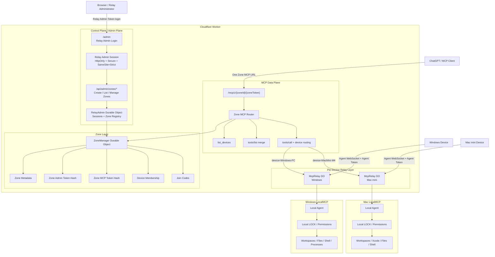
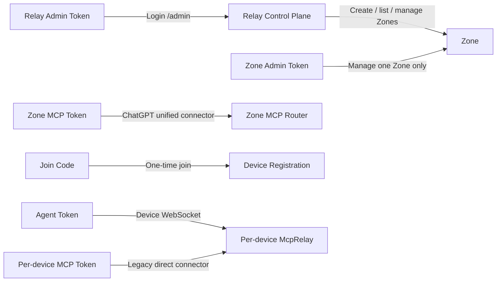
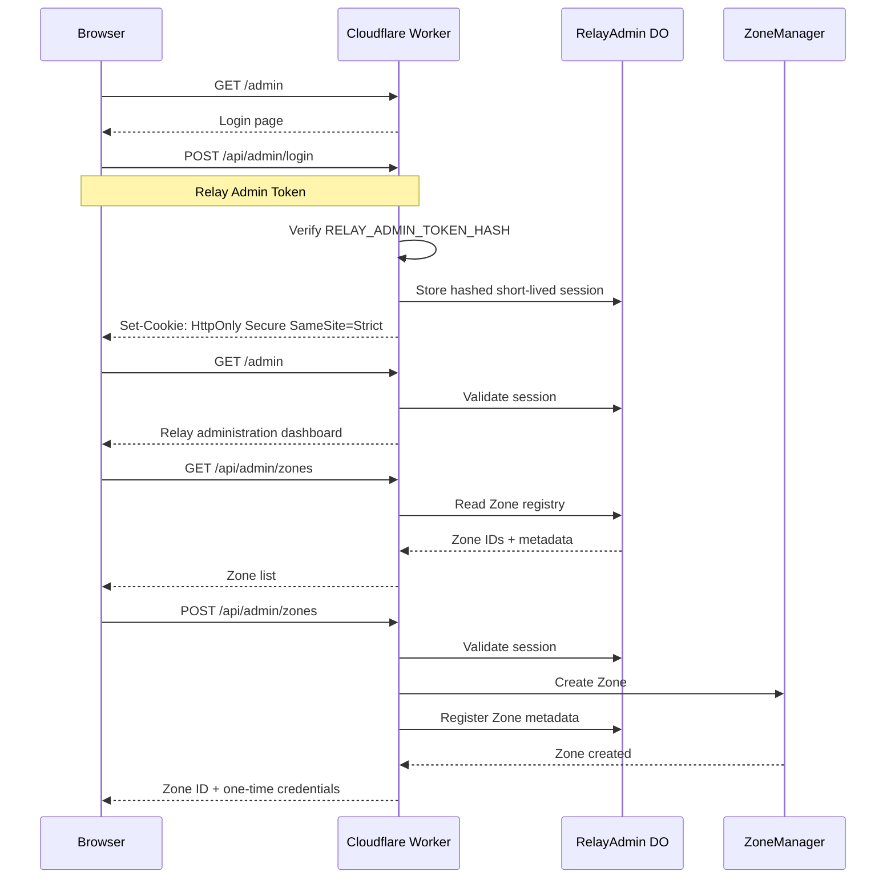
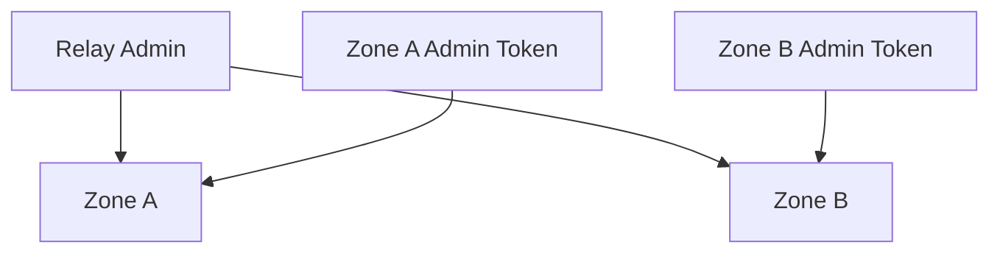
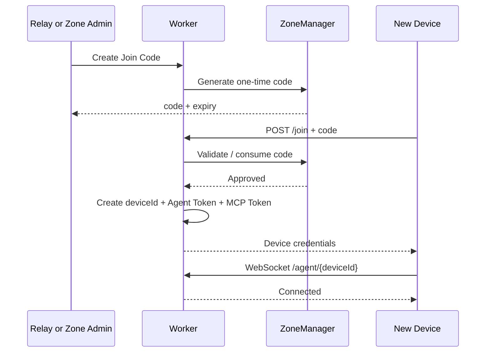
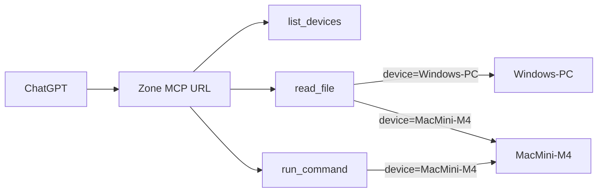
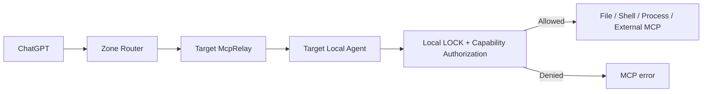

# Relay Control Plane and Multi-Device Zone Architecture

This document defines the target architecture for Easy Local MCP's Cloudflare Relay management plane, shared Zone MCP routing, and per-device execution boundary.

The design separates **Relay administration**, **Zone administration**, **MCP routing**, and **device execution** so that a public Relay endpoint does not imply public administrative access.

## Goals

- One Cloudflare Worker can host multiple independent Zones.
- One Zone can contain multiple LocalMCP devices.
- ChatGPT can use one Zone MCP connector and route tools to a selected device.
- Opening `/admin` must not grant management access.
- Relay-wide administration and Zone-scoped administration use different credentials.
- Device-local LOCK and capability checks remain the final execution authority.
- Existing per-device MCP URLs remain compatible.
- Existing Zones can be imported into the Relay administrator registry after upgrading.

## High-level architecture



## Credential boundaries



The credentials are deliberately not interchangeable:

- **Relay Admin Token**: Relay-wide control-plane authority.
- **Zone Admin Token**: authority over one Zone only.
- **Zone MCP Token**: authentication for the shared ChatGPT connector.
- **Join Code**: short-lived, single-use device admission credential.
- **Agent Token**: authenticates one LocalMCP Agent.
- **Per-device MCP Token**: authenticates the legacy/direct MCP connector for one device.

## Relay administrator model

The Relay administrator uses a dedicated Cloudflare secret:

```text
RELAY_ADMIN_TOKEN_HASH
```

The raw Relay Admin Token is never stored by the Worker. Login compares the supplied token to the configured SHA-256 hash using constant-time comparison.

A successful login creates a high-entropy random session token. Only the session token hash is stored in the `RelayAdmin` Durable Object.

The browser receives:

```text
HttpOnly
Secure
SameSite=Strict
Path=/
```

session cookie attributes.

Sessions are short-lived and can be explicitly logged out. Mutating control-plane APIs also require same-origin browser requests.

If `RELAY_ADMIN_TOKEN_HASH` is not configured, `/admin` shows a configuration-required page and control-plane management APIs remain unavailable.

## Relay administration flow



## RelayAdmin Durable Object

A singleton `RelayAdmin` Durable Object provides the Relay-wide control-plane state.

It stores:

- hashed active admin sessions and expiry timestamps;
- Zone registry entries:
  - Zone ID;
  - Zone name;
  - created timestamp.

It does **not** store:

- raw Relay Admin Tokens;
- raw Zone Admin Tokens;
- raw Zone MCP Tokens;
- device Agent Tokens;
- per-device MCP Tokens.

The registry exists so the Relay administrator can list Zones without scanning Durable Object namespaces.

## Existing Zone migration

Zones created before the Relay administrator registry exists remain valid because Zone state stays in the existing `ZoneManager` Durable Object.

The admin dashboard provides an **Import Existing Zone** operation:

1. enter Zone ID;
2. enter that Zone's existing Zone Admin Token;
3. Worker validates the token against `ZoneManager`;
4. RelayAdmin registers only the Zone ID/name/created timestamp;
5. the raw Zone Admin Token is discarded.

No Zone recreation is required.

## Zone administrator model

Relay Admin and Zone Admin are intentionally different.



This allows a Relay owner to delegate one Zone without granting Relay-wide access.

Existing Zone-scoped APIs remain authenticated by Zone Admin Token for compatibility and delegated administration.

Relay-wide admin APIs can call `ZoneManager` over Worker-internal requests without needing to recover or retain Zone Admin Tokens.

## Device join flow



Join Codes remain single-use and expire quickly. A successful join receives fresh per-device credentials.

## Shared Zone MCP routing



The Zone MCP router:

- authenticates the Zone MCP Token;
- exposes `list_devices`;
- merges tool schemas discovered from Zone devices;
- adds a required `device` argument to routed tools;
- resolves device name or immutable device ID;
- forwards the MCP request internally to the selected `McpRelay`.

The router does not use the selected device's plaintext MCP credential.

## Local authorization remains authoritative



The Cloudflare control plane cannot unlock a LocalMCP Agent and cannot override local feature permissions.

## Public and protected surfaces

### Public protocol surfaces

These remain reachable without Relay Admin login but require their own scoped credentials:

- `/join` — one-time Join Code.
- `/agent/{deviceId}` — Agent Token.
- `/mcp/{deviceId}/{mcpToken}` — per-device MCP Token.
- `/mcp/z/{zoneId}/{zoneMcpToken}` — Zone MCP Token.
- `/healthz` — non-sensitive service health.

### Relay administration surfaces

- `/admin` — public login shell only until authenticated.
- `/api/admin/login` — Relay Admin Token verification.
- `/api/admin/logout` — invalidate current session.
- `/api/admin/zones/*` — Relay Admin Session required.

### Zone-scoped management surfaces

Existing Zone Admin Token APIs remain available for scoped/delegated management, but **new Zone creation is Relay Admin only**. `REGISTRATION_TOKEN_HASH` does not grant Zone-creation authority.

## Security invariants

1. A public `/admin` URL must never expose management actions without authentication.
2. Missing `RELAY_ADMIN_TOKEN_HASH` must fail closed.
3. Relay Admin sessions are random, short-lived, HttpOnly, Secure, SameSite=Strict, and stored only as hashes.
4. State-changing browser APIs require same-origin requests.
5. Relay Admin Token, Zone Admin Token, Zone MCP Token, Join Code, Agent Token, and per-device MCP Token are separate credentials.
6. Zone MCP routing must not bypass Local Agent LOCK or capability checks.
7. Revoking a device invalidates its Agent and direct MCP credentials.
8. Rotating a Zone connector immediately invalidates the previous Zone MCP URL.
9. Existing direct device MCP URLs continue to work unless that device is revoked or its credentials are rotated.
10. No management token is written to logs or returned from status endpoints.

## Deployment configuration

A production Relay with the management plane should configure at least:

```text
RELAY_ADMIN_TOKEN_HASH=<sha256 of a strong Relay Admin Token>
```

Optional registration protection remains:

```text
REGISTRATION_TOKEN_HASH=<sha256 of registration token>
```

The two credentials must not be reused for the same purpose.

## Implementation phases

### Phase A — Relay Admin authentication

- add `RelayAdmin` Durable Object;
- add v3 Durable Object migration;
- add Relay Admin login/logout/session validation;
- make `/admin` show only login until authenticated;
- fail closed when Relay Admin auth is not configured.

### Phase B — Relay Zone registry

- register new Zones in RelayAdmin;
- list Zones from authenticated admin dashboard;
- import legacy existing Zones using Zone ID + Zone Admin Token.

### Phase C — Relay-wide Zone management

- create Join Codes through Relay Admin session;
- rotate Zone connector through Relay Admin session;
- rename/revoke devices through Relay Admin session;
- retain Zone Admin Token APIs for delegated administration.

### Phase D — Validation

- login/session/logout tests;
- unauthenticated admin denial tests;
- session expiry tests;
- legacy Zone import tests;
- Zone connector routing regression tests;
- LOCK/UNLOCK preservation tests;
- credential rotation and revocation tests.
