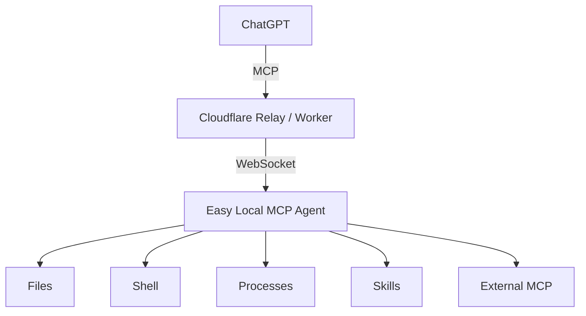

# Easy Local MCP Wiki

Easy Local MCP is a secure local MCP bridge that lets ChatGPT use capabilities on your own computer without exposing an inbound port.

## Start here

- [[Getting Started]]
- [[Security Model]]
- [[Configuration]]
- [[Self-hosted Relay]]
- [[Multi-Device Zones]]
- [[Development]]
- [[Troubleshooting]]

## Project README

- [English README](https://github.com/Ryanma-YX/easy-local-mcp/blob/master/README.md)
- [简体中文 README](https://github.com/Ryanma-YX/easy-local-mcp/blob/master/README.zh-CN.md)

## Important security note

The complete MCP URL contains an access credential. Treat it like a secret.

The Agent starts **LOCKED**. Configured privileged tools remain discoverable while locked so ChatGPT can refresh connector capabilities, but privileged execution is denied until the user explicitly unlocks the Agent locally.
