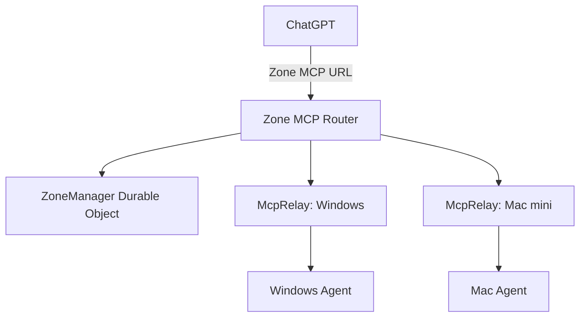

# Multi-Device Zones

Multi-Device Zones group several Easy Local MCP devices behind the same Relay and expose one shared MCP connector for the whole group.

Each device still owns its existing per-device `McpRelay`, Agent token, MCP token, local workspaces, LOCK state, and feature permissions. The Zone adds a control plane and a lightweight MCP router above those existing security boundaries.

## Architecture



The Zone router does not store or use the individual devices' plaintext MCP tokens. It routes internally to the selected per-device Relay, while the target Agent continues to enforce its local LOCK state and configured capabilities.

## What a Zone stores

A dedicated Cloudflare Durable Object stores only Zone management state:

- Zone name
- Zone administrator credential hash
- Zone MCP connector credential hash
- joined device IDs and display names
- platform / architecture / version metadata
- one-time join-code hashes and expiration times

The administrator and Zone MCP tokens are returned only when created or rotated. The Relay stores their SHA-256 hashes.

## Open the Zone manager

On a Relay that includes Zone support, open:

```text
https://your-relay.example/admin
```

The page can:

- create a Zone
- show the shared Zone MCP connector URL when it is created
- rotate the Zone connector credential
- generate a one-time join code
- list devices and their online/offline state
- rename a device
- revoke a device

If the Relay is protected with `REGISTRATION_TOKEN_HASH`, creating a Zone requires the corresponding registration token.

Existing Zones created by the earlier management-only Zone build remain valid. Open the Zone and choose **Rotate Connector** once to create the shared MCP connector credential.

## Join another device

1. Configure the new device to use the same Relay.
2. In the Zone manager, create a one-time join code.
3. Stop Easy Local MCP on the device if it is already running.
4. Stage the join:

```bash
localmcp join <zone-code>
```

5. Start Easy Local MCP normally.

The join code is single-use and expires after 10 minutes by default. A successful join creates fresh per-device Agent and MCP credentials and deletes the pending local join code.

The display name defaults to the local hostname. The Zone administrator can rename it later.

## Use one connector in ChatGPT

Configure ChatGPT with the Zone MCP URL shown when the Zone is created or when **Rotate Connector** is used:

```text
https://your-relay.example/mcp/z/<zone-id>/<zone-mcp-token>
```

The Zone connector exposes:

- `list_devices`
- the normal LocalMCP tools discovered from the currently available Zone devices

Routed LocalMCP tools include an additional required `device` argument.

Example:

```json
{
  "device": "MacMini-M4",
  "workspace": "PlayCover",
  "path": "README.md"
}
```

The `device` value can be a unique device display name or the exact device ID returned by `list_devices`.

If multiple devices have the same display name, use the device ID.

## Permissions and LOCK state

The Zone connector is a routing layer, not a permission bypass.

For example, if a target device is locally LOCKED:

```text
ChatGPT
  -> Zone MCP
  -> target McpRelay
  -> target Agent
  -> local authorization rejects privileged execution
```

Read-only capabilities that are permitted locally continue to work. Writes, shell commands, processes, or external MCP execution remain subject to the target device's normal LocalMCP policy.

## Connector rotation

The Zone administrator can choose **Rotate Connector** in `/admin`.

Rotation:

1. creates a new Zone MCP token;
2. stores only the new token hash;
3. immediately invalidates the previous Zone MCP URL.

Device Agent and per-device MCP credentials are not changed.

## Revocation

Revoking a device from the Zone:

1. removes it from the Zone device list;
2. invalidates that device's Relay Agent and MCP credentials;
3. disconnects its active Agent WebSocket.

The revoked device must register or join again before it can reconnect.

## Credential separation

The credentials have different purposes:

- **registration token**: optionally protects creation and registration operations on a self-hosted Relay
- **Zone admin token**: manages one Zone
- **Zone MCP token**: authenticates the shared ChatGPT connector
- **join code**: short-lived, single-use credential for adding one device
- **Agent token**: authenticates one local Agent to its per-device Relay
- **per-device MCP token**: authenticates the legacy/direct connector for one device

Do not use the Zone admin token as a ChatGPT connector credential.

## Compatibility

Per-device MCP URLs remain available. This means an existing single-device connector can continue working while the same device also belongs to a Zone.

The shared Zone connector is additive and does not require changing the target device's workspace configuration or LocalMCP security settings.

## Current behavior

The Zone router discovers and merges tool schemas from online devices. `list_devices` remains available so ChatGPT can check device names and online state before choosing a target.

A tool that is not available on the selected device is rejected by that device rather than silently redirected elsewhere.
