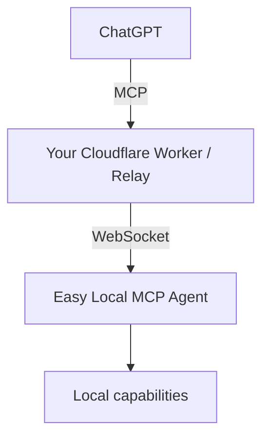

# Self-hosted Relay

Easy Local MCP can use the prefilled public Relay for quick evaluation. That Relay is currently an upstream/community shared service, so its availability, capacity, and long-term continuity are outside this fork's control.

For regular or long-term use, a Relay under your own control is recommended. It can run on a machine you manage with a reachable HTTPS endpoint, on your own VPS, or on your own Cloudflare Worker.

Typical examples:

- company source code
- ERP / MES data
- internal documents
- credentials
- production administration

## Architecture



The local Agent initiates the outbound WebSocket connection. No inbound port is required on the local machine.

## Deploy to Cloudflare

[](https://deploy.workers.cloudflare.com/?url=https://github.com/Ryanma-YX/easy-local-mcp)

After deployment:

1. Open the Worker in Cloudflare.
2. Go to **Settings → Domains & Routes**.
3. Copy the `workers.dev` URL.
4. Enter that URL in Easy Local MCP during first-run setup.

Example:

```text
https://easy-local-mcp-relay.YOUR-SUBDOMAIN.workers.dev
```

## Manual deployment

```powershell
npm ci
npm run worker:deploy
```

## Registration protection

A self-hosted Worker can use registration protection with:

```text
REGISTRATION_TOKEN_HASH
```

The Easy Local MCP first-run setup accepts the corresponding raw registration token.

The raw registration token:

- is not included in the MCP URL
- is not written to the ordinary configuration file
- is not written to the audit log
- is removed after registration credentials are persisted

## Verify the Worker

A basic health check:

```sh
curl https://YOUR-WORKER.workers.dev/healthz
```

A healthy Relay should return a JSON response indicating that the service is available.

## Switching Relay

Changing a Relay is a security-sensitive operation because device credentials are tied to registration.

Use the Control Center setup/reconfiguration flow rather than manually copying credentials between Workers.

## Trust boundary

The Relay is part of the trust boundary. Self-hosting gives you control of that intermediary, but the current design should not be treated as end-to-end encryption between ChatGPT and the local Agent.

See [[Security Model]] for the rest of the security model.
